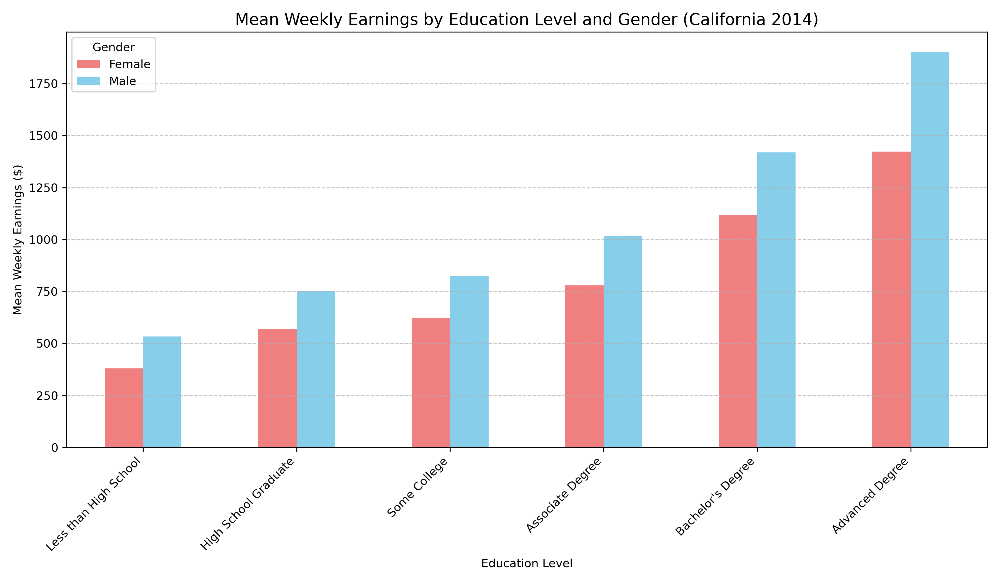
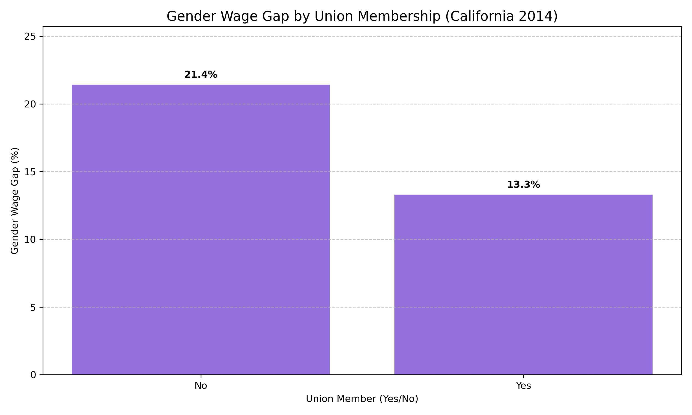

## Project Overview

This analysis explores the 2014 Merged Outgoing Rotation Groups (MORG) data from the Current Population Survey (CPS), specifically focused on California. The analysis follows an **Object-Oriented Programming (OOP)** pattern, utilizing a custom `CAEarningsProcessor` class to handle data cleaning, transformation, and statistical calculations.

### Technical Implementation

-   **Inheritance**: `CAEarningsProcessor` inherits from `BaseDataProcessor`, ensuring a consistent interface for data loading and preprocessing.
-   **Encapsulation**: Data filtering and grouping logic are encapsulated within class methods, keeping the visualization code clean and focused.

### Key Visualizations

Below are two key insights from the California earnings data:

#### Earnings by Education and Gender
{#fig-ca-earnings}

#### Union Membership and the Gender Wage Gap
{#fig-ca-gap}
