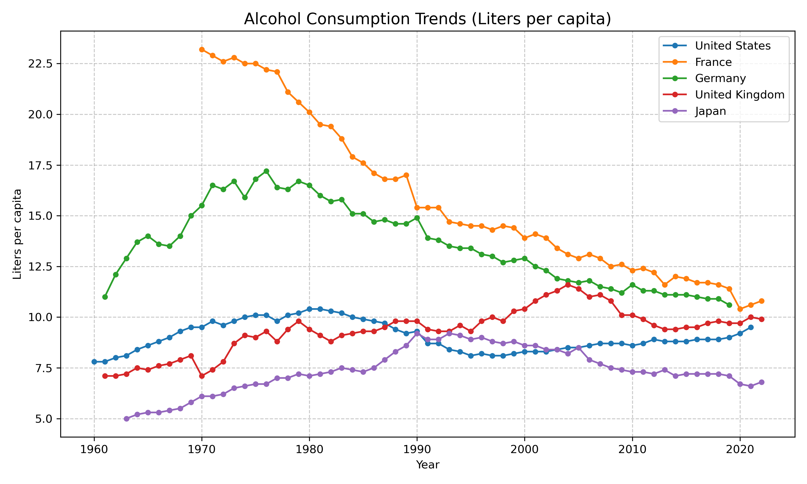
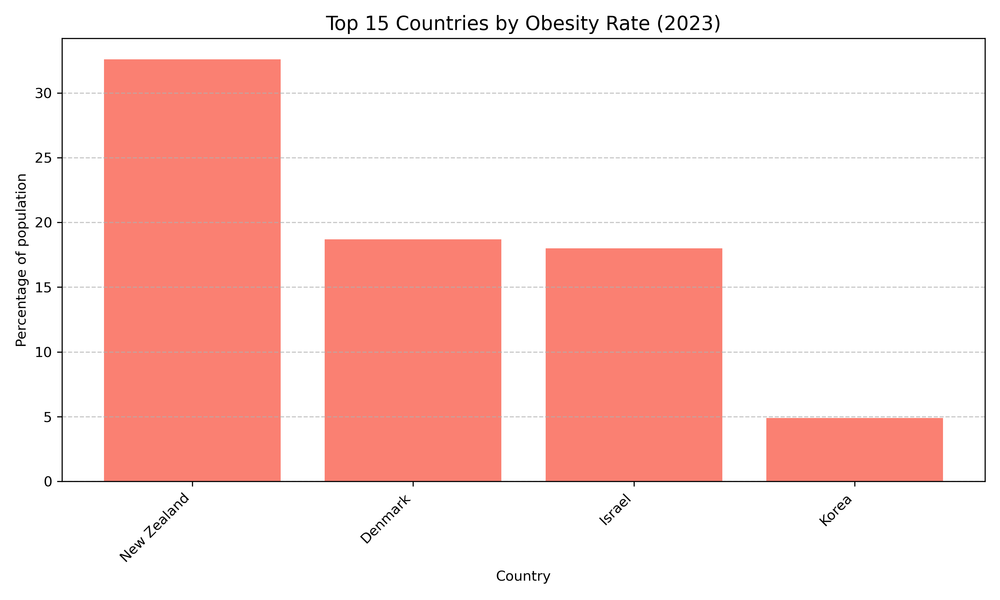

## Project Overview

In this project, I analyze health risk factors across OECD countries using an **Object-Oriented Programming (OOP)** approach. By structuring the data processing logic into classes, I've created a maintainable and scalable analysis pipeline.

### Key Features
- **OOP Structure**: Data loading, cleaning, and filtering are handled by a dedicated `OECDDataProcessor` class.
- **Interactive Visualization**: Explore trends in alcohol consumption, tobacco use, and obesity across different nations.
- **Dynamic Filtering**: Select specific health measures and countries to see how health trends have evolved over decades.

### Visual Analysis

Below are static visualizations generated from the OECD health risk factors dataset.

#### Alcohol Consumption Trends
{#fig-oecd-alcohol}

#### Obesity Rates Comparison
{#fig-oecd-obesity}
