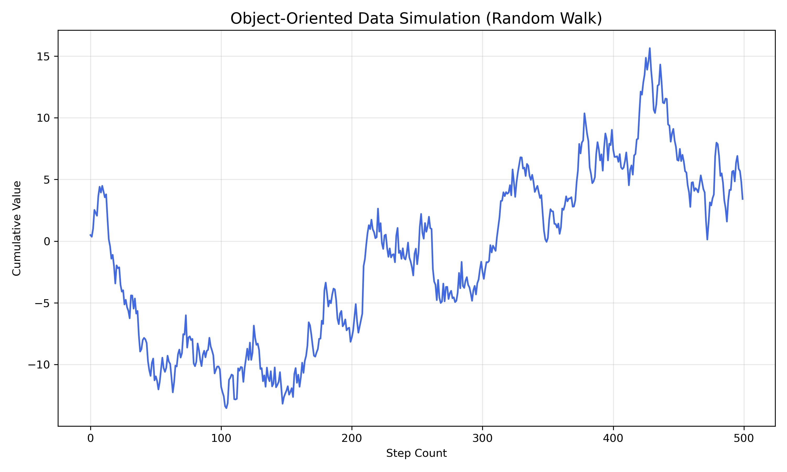
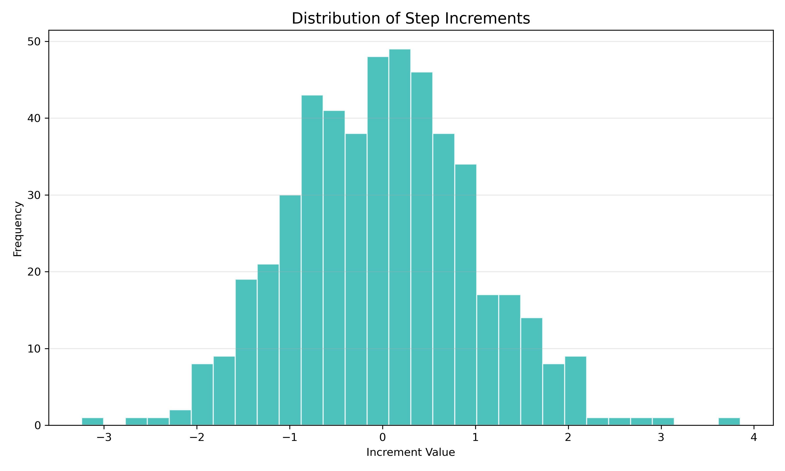

## Project Overview

This project demonstrates the power of **Object-Oriented Programming (OOP)** in data science. Instead of writing procedural scripts, I've built a robust data architecture that can simulate, process, and visualize data through a consistent interface.

### The Architecture

-   **Base Class**: `BaseDataProcessor` defines the blueprint for all data operations.
-   **Concrete Class**: `PortfolioData` implements specific logic for random walk simulations and statistical distributions.
-   **Extensibility**: This pattern allows for easy addition of new data sources and processing methods without breaking existing code.

### Visual Showcase

Below are visualizations generated by the `PortfolioData` class, demonstrating its ability to manage state and complex transformations.

::: {layout-nw="[[1,1]]"}
{group="portfolio"}

{group="portfolio"}
:::
