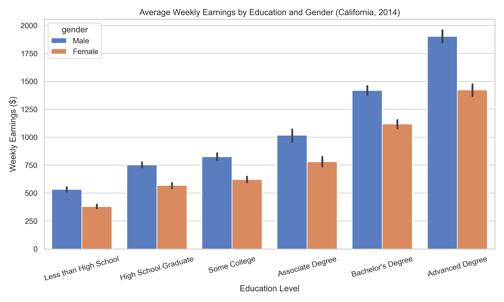
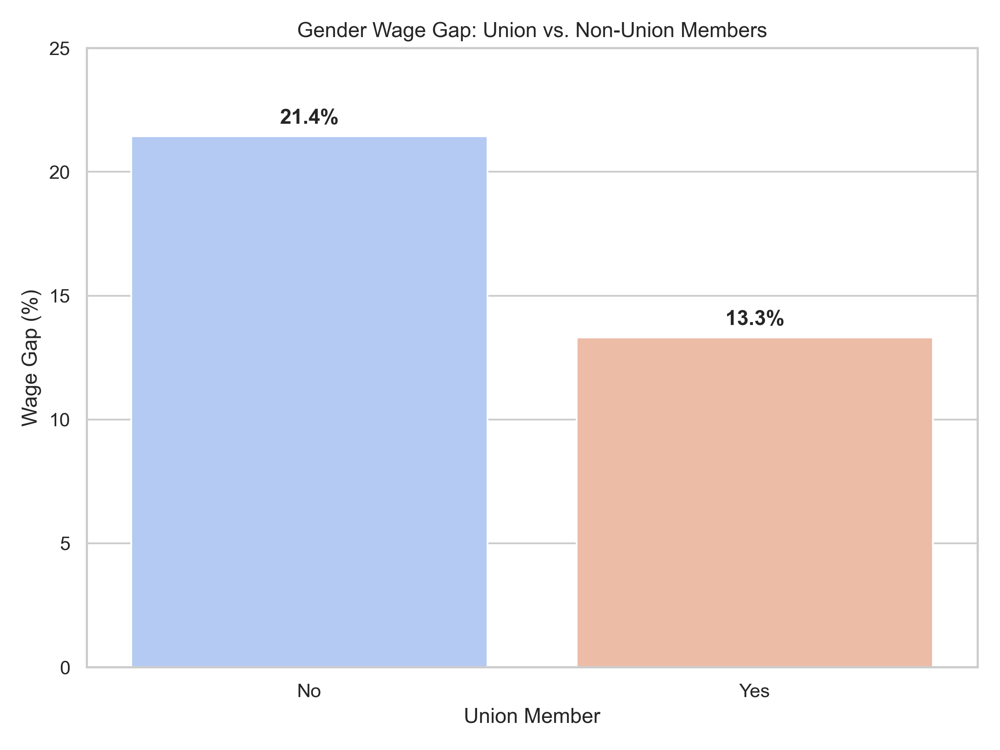

# Analysis: The State of Earnings in California (2014)

## Introduction
This report analyzes data from the 2014 Merged Outgoing Rotation Groups (MORG) of the Current Population Survey (CPS). The focus is on California, examining how weekly earnings are influenced by education, gender, and union membership.

**Dataset Overview:**
- Total California respondents: 12,490
- Overall average weekly earnings: $947.59

---

## 1. Education: The Primary Driver of Earnings
Education remains the most significant predictor of weekly earnings.

| Education Level | Male Avg Weekly | Female Avg Weekly | Gender Wage Gap (%) |
|:---|:---:|:---:|:---:|
| Less than High School | $533.41 | $379.76 | 28.8% |
| High School Graduate | $752.16 | $568.17 | 24.5% |
| Some College | $825.51 | $621.88 | 24.7% |
| Associate Degree | $1,018.22 | $780.15 | 23.4% |
| Bachelor's Degree | $1,418.39 | $1,118.62 | 21.1% |
| Advanced Degree | $1,903.02 | $1,423.33 | 25.2% |

### Key Finding:
The wage gap persists across all education levels, but is notably different in its magnitude. Interestingly, the gap often widens as education increases, suggesting that while higher education raises the "floor" for everyone, "glass ceilings" may still affect women at higher professional levels.

---

## 2. The Union Membership Premium
Union membership has traditionally been seen as a way to standardize wages and reduce inequality.

| Union Member | Male Avg Weekly | Female Avg Weekly | Gender Wage Gap (%) |
|:---|:---:|:---:|:---:|
| No | $1,022.50 | $803.35 | 21.4% |
| Yes | $1,171.48 | $1,015.59 | 13.3% |

### Key Finding:
Union membership appears to **reduce** the gender wage gap. For union members, the gap is 13.3%, compared to 21.4% for non-union members.

---

## 3. Conclusion
The data from 2014 California MORG shows clear trends:
1. **Education Payoff:** There is a clear upward trajectory in earnings associated with education.
2. **Persistent Gap:** A gender wage gap exists at every educational tier.
3. **Union Influence:** Unionization significantly impacts wage distribution and the gender gap.
