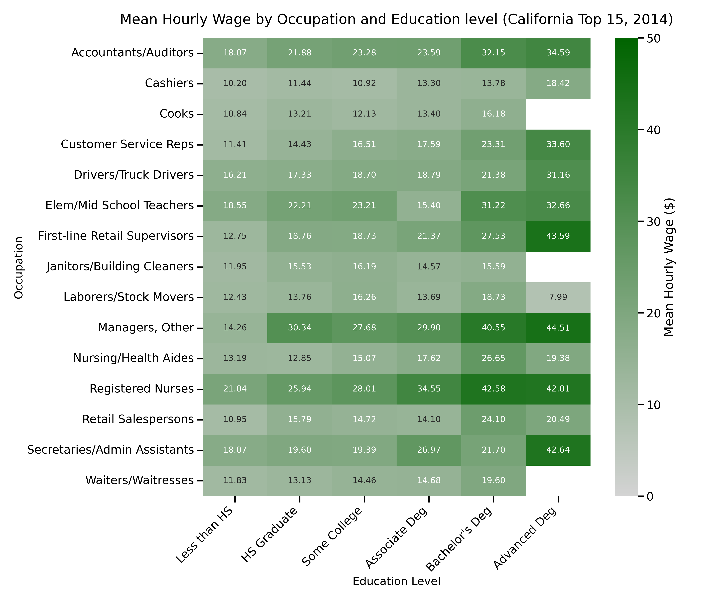

# Analysis: Hourly Wages by Occupation and Education Level (California)

This report examines the relationship between educational attainment and hourly compensation across the most frequent occupations in California using the 2014 Merged Outgoing Rotation Groups (MORG) dataset.

## Visualization: Hourly Wage Heatmap

The following heatmap displays the average hourly wage for the top 15 occupations by respondent frequency, segmented by their highest level of education. The color scale ranges from grey (\$0) to deep green (\$50+).

## Key Observations

1.  **Educational Premium:** In almost every occupation, individuals with a Bachelor's or Advanced Degree earn significantly more than their counterparts with only a high school education.
2.  **High-Wage Leaders:** **Registered Nurses** and **Accountants/Auditors** with advanced degrees represent the highest earning segments in this dataset, frequently exceeding the \$40/hour mark.
3.  **The Wage Floor:** Entry-level service roles such as **Cashiers** and **Waiters/Waitresses** show a much tighter wage distribution, often staying in the grey-to-light-green zone (under \$15/hour) regardless of education level.
4.  **Specialized vs. General Roles:** Professional occupations show a much steeper "return on education" compared to administrative or manual labor roles.

## Data Source
Data derived from the 2014 CPS Merged Outgoing Rotation Groups (MORG) dataset, filtered specifically for California respondents.
